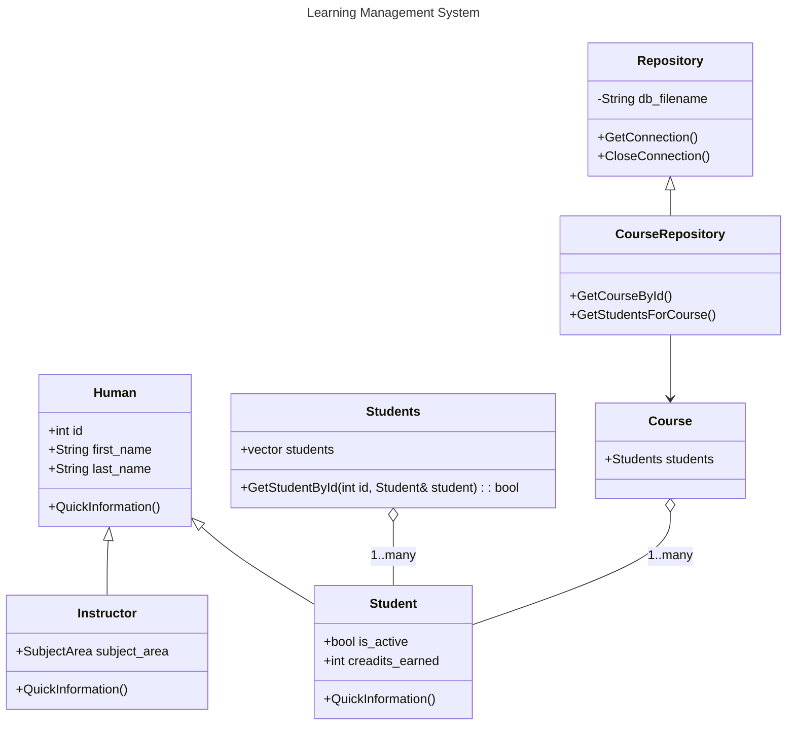

# 12 Design and documentation

## Assignment spec

(10 points) Please create technical documentation for LMS app with a class diagram approximately describing current code. You can use the present file for it. 

## Steps

- Please accept assignment `12` from *BlackBoard* as usual. Visit generated repo `OU-CTCH1330/12-design-documentation-yourGitHubId` on GitHub
<br /><span style='color: yellow'>Warning:</span> From acceptance page please don't go to Codespace straight, instead please first open repo with a link. Confirm 9 commits showing, with last commit being _"Add assignment deadline url"_. If not all of commits appear wait before opening Codespace. Repo setup takes few seconds and if Codespace is opened prematurely some commits will be missed. This will create sync conflicts later. 
- Please take a moment to go over classes in `data/`, `domain/` and `ui/` folders, pay attention to inheritance chain between them. 
- Please take a moment to go over [markdown](https://docs.github.com/en/get-started/writing-on-github/getting-started-with-writing-and-formatting-on-github/basic-writing-and-formatting-syntax) syntax and [mermaid](https://docs.github.com/en/get-started/writing-on-github/working-with-advanced-formatting/creating-diagrams) syntax. Follow further link to mermaid [docs](https://mermaid.js.org/intro/) and check `Class Diagram` section there. 
- For class diagrams feel free to use a different tool than mermaid. For instance [draw.io](https://www.diagrams.net/) is another choice, there are both web-based and desktop versions. You can draw there, export `jpg/png`, add image file to Git and insert that image in markdown documentation. 
- Please write down a design document of what would be your description of LMS app. Please use present `README.md` for it, you can append your writing to the bottom of present text instructions. You can include some wishful thinking of what app is expected to do, but also stay relevant to current code and class design. Please make sure your documentation has:
  - some use of markdown headers, give your document a some structure
  - at least one `inline` or 
  ``` 
  block 
  ``` 
  code
  - at least one [link](https://www.google.com/)
  - at least one table

  | table | description |
  | -- | -- | 
  | item1 | description 1| 
  - at least one numbered or bullet point list
  - at least a fragment of class diagram, with some inheritance chain in it
  - (2 point bonus) have image embedded in your documentation. 
- Remember, VS Code has `Preview` side-by-side mode, where you can see markdown rendered as you type.
- Stage, commit and sync your code. Please make sure your `README.md` is properly rendered by going to your GitHub repo. This assignment is graded manually, please upload your repo url to BlackBoard once done.


## General tips 

These tips are general, not specific to current assignment.

- If something goes wrong, please reach out early on, <span style='color: #8ae234'>**DO NOT STRUGGLE**</span>. 
- Use GitHub PR, BlackBoard Discussions, MS Teams, email, or any other means for reaching out for instructor's help. Also feel free to collaborate with fellow students, especially now that sprint project has fostered an excellent teamwork. 
- Please remember, instructor can't see your code until sync'd with GitHub repo. Further, if you want to let fellow students examine your code your repo needs to be [made public](https://docs.github.com/en/repositories/managing-your-repositorys-settings-and-features/managing-repository-settings/setting-repository-visibility#changing-a-repositorys-visibility) (it's private at creation). Peer collaboration is highly encouraged, as long as it's genuine learning as opposed to mechanical copy/paste (see policies in the syllabus at BlackBoard > CTCH1330 > Docs).
- Syncing incremental progress milestones is recommended. Autograder doesn't care about repeated failures, only final success matters. 
- GitHub PR is an excellent place for code-centric discussions. This is also a standard in industry.
- Each assignment/repo expects a dedicated Codespace
- Please try not to spam Codespaces. If you've already created an instance for given repo, it's available at  [https://github.com/codespaces](https://github.com/codespaces) and they load faster (than a cold start of a fresh Codespace). Having multiple instances will fragment your work, as each Codespace has its individual local file system and one doesn't see changes in others, unless obviously synced through GitHub repo, to which they are all linked. Multiple instances may also create conflicts between different code edits, you will be unable to commit/sync (please reach out if that has happened).
- Consider cleaning up CodeSpaces for past assignments. They can be deleted (if running, stopped and deleted) by clicking `...` next to them. This is optional, as old Codespaces are discarded anyway after a period of inactivity.  

## Learning Management System spec

LMS is meant to allow management of university curriculum, course instances and student body. It should allow user to navigate UI in intuitive manner and perform functions like:
- Manage semesters, courses, classes, students.
- Management typically means adding, deleting and editing capabilities. 
- Associated data should be navigable and linked. For instance from viewing the class one should be able to navigate to students in that class, or from viewing a student one should be able to navigate to classes that student is enrolled in.
- App is a desktop app, it does not have a remote server and is not expected to allow multi-user concurrent operation. data is persisted in a database that is available locally.
- LMS code should be maintainable, with well-developed domain and unit tests allowing future enhancements and safeguarding against bugs. 
- App is intended for a single persona - a manager. This person will be able to perform all operations.

LMS has following screens:
| Screen | Description |
| -- | -- |
| Main menu | Initial load, root of navigation |
| Courses Menu | Functionality menu for courses, curriculum management, course design |
| Classes Menu | Functionality menu for classes, specific instances with students in it |
| Student Menu | Functionality menu for student management |

Each functional menu will have options for searching/viewing, adding. Each view screen will have options for editing and deleting.

App will have a `data access layer` which will abstract away database from the rest of application. 

### Class design

Below is domain design for LMS

